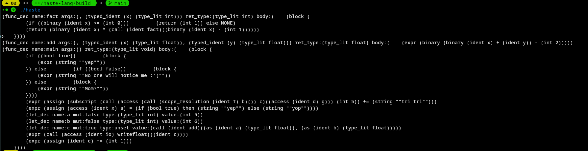

# haste-lang

## How to try haste?

1. you got to install the repo first and navigate to where you clone the repo

```sh
git clone https://github.com/mega-haste/haste-lang
$ cd haste-lang
```

2. You should be already installed cmake and run this command

```sh
cmake -S . -G "Unix Makefiles" -B build
```

3. Finally you can run haste (as a test)

```sh
make
./haste-test
```

## Language progress

- [x] Scanner
- [ ] Parser
  - [ ] Expressions
    - [x] Primaries
    - [x] Math (+, -, *, **, /, %)
    - [x] Comparition (==, !=, <, >, >=, =<)
    - [x] Logical (not, and, or)
    - [x] Bitewise (&, |, ~, <<, >>)
    - [x] inline if (if .. then .. else ..)
    - [x] as (type casting `expr as Type`)
    - [x] call expression
    - [x] member access
    - [x] Subscript (`expr[v]`)
    - [x] Scope resolusion
    - [x] Tuple
    - [x] assignment
    - [ ] referencing and dereferencing (`&expr` and `*expr`)
  - [ ] Types
    - [x] Built-in types (**int**, **uint**, **float**, **string**, **void**, **bool**)
    - [x] Slices (`T[int]`, `T[]`)
    - [ ] Tuple (`(T, R, Y, X, ...)`)
    - [ ] Generics aka. templates in c++ (`T<Args>`)
  - [ ] Statements
    - [x] returns
    - [x] if
    - [x] let
    - [ ] functions (needs to add generecs to it)

### Parsing `examples/parsing.haste` output



```
(func_dec name:fact args:(, (typed_ident (x) (type_lit int))) ret_type:(type_lit int) body:(    (block {
        (if ((binary (ident x) <= (int 0)))         (return (int 1)) else NONE)
        (return (binary (ident x) * (call (ident fact)((binary (ident x) - (int 1))))))
    })))
(func_dec name:add args:(, (typed_ident (x) (type_lit float)), (typed_ident (y) (type_lit float))) ret_type:(type_lit float) body:(    (expr (binary (binary (ident x) + (ident y)) - (int 2)))))
(func_dec name:main args:() ret_type:(type_lit void) body:(    (block {
        (if ((bool true))         (block {
            (expr (string ""yep""))
        }) else         (if ((bool false))         (block {
            (expr (string ""No one will notice me :'(""))
        }) else         (block {
            (expr (string ""Mom?""))
        })))
        (expr (assign (subscript (call (access (call (scope_resolution (ident T) b)()) c)((access (ident d) g))) (int 5)) += (string ""tri tri"")))
        (expr (assign (access (ident x) a) = (if (bool true) then (string ""yep"") else (string ""yop""))))
        (let_dec name:a mut:false type:(type_lit int) value:(int 5))
        (let_dec name:b mut:false type:(type_lit int) value:(int 6))
        (let_dec name:c mut:true type:unset value:(call (ident add)((as (ident a) (type_lit float)), (as (ident b) (type_lit float)))))
        (expr (call (access (ident io) writefloat)((ident c))))
        (expr (assign (ident c) += (int 1)))
    })))
```

## My goals

- [ ] Better Error messages
- [ ] Adding a good type-checking & Semantic analysis
- [ ] Traspiling haste to c (I'm planing on using llvm to compile haste directly to machine code)

## Something

I dropped the idea of tags, sorry [Amir](https://github.com/Ameeer1)
